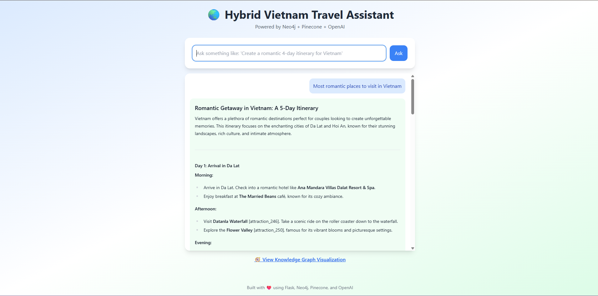

# 🌏 GoViet — Hybrid Travel Intelligence System 🧠✈️

**GoViet** is an intelligent **hybrid travel planning system** that blends **semantic vector search** with **graph-based reasoning** to generate **hyper-contextual and dynamic travel itineraries**.  
The system combines the power of **Pinecone (vector database)** and **Neo4j (graph database)** with OpenAI to deliver meaningful, structured, and personalized travel recommendations — just like a human travel expert would.

> 🚀 Built for Scale | 🧠 Designed for Intelligence | 🌐 Inspired by Real Travel Experiences

---

## 🖼️ Project Demo & Links

- 🎥 **Loom Video (2-min walkthrough):** [👉 Click Here](https://www.loom.com/share/your-loom-link-here)  
- 💻 **GitHub Repository:** [GoViet](https://github.com/Abhay-Chand/GoViet)  
- 🌐 **Localhost URL:** `http://127.0.0.1:5000` (Flask app)  
- 📂 Dataset: `vietnam_travel_dataset.json`

---

## ✨ Key Highlights

- 🧭 **Hybrid Retrieval (Vector + Graph)**  
  Pinecone handles **semantic similarity**, Neo4j handles **relationship reasoning** — resulting in richer, more accurate itineraries.

- 🧠 **Dynamic Graph Knowledge Base**  
  Neo4j stores places, attractions, and semantic relationships. The graph evolves as data grows.

- 📊 **Semantic Search via Pinecone**  
  Fast retrieval of relevant attractions or itineraries based on natural language queries.

- 🛠 **Modular Architecture**  
  Clean separation of embedding, uploading, querying, and front-end layers.

- 🌍 **Real Travel Dataset**  
  Vietnam itinerary dataset with location metadata, attractions, and itineraries used to generate realistic outputs.

- 🚀 **Scalable to Millions of Nodes**  
  Carefully designed schema and hybrid indexing approach to handle large-scale deployments.

---

## 🧠 Why Hybrid Retrieval?

Most systems rely on either **vector search** (good for semantics) or **graph search** (good for structure).  
GoViet uses both because:

- **Pinecone (Vector)**: Finds places similar in meaning.  
  _Example_: “romantic spots in Hanoi” retrieves relevant attractions even if keywords don’t match exactly.

- **Neo4j (Graph)**: Finds how entities are **related**.  
  _Example_: Connecting “Hanoi” → “Old Quarter” → “Hotels” → “Spa Packages”.

👉 This hybrid approach makes answers **contextually accurate**, **explainable**, and **scalable**.

---

## 🧰 Tech Stack

| Layer             | Technology Used                 |
|-------------------|----------------------------------|
| Language Model    | OpenAI GPT                      |
| Vector Database   | Pinecone                        |
| Graph Database    | Neo4j                           |
| Backend           | Python (Flask)                  |
| Frontend          | HTML + TailwindCSS              |
| Visualization     | Neo4j Browser / HTML Graph Viz  |
| Dataset           | Vietnam Travel Dataset (JSON)   |

---

## 🏗️ System Architecture

                ┌────────────────────┐
                │   User Interface   │
                │ (Flask Frontend)   │
                └─────────┬──────────┘
                          │
            ┌─────────────▼─────────────┐
            │  Hybrid Retrieval Layer   │
            │ (Vector + Graph Fusion)   │
            └───────┬───────────┬───────┘
                    │           │
    ┌───────────────▼───┐   ┌───▼────────────────┐
    │ Pinecone Vector DB│   │ Neo4j Graph DB     │
    │ Semantic Search   │   │ Relationship Query │
    └───────────────────┘   └───────────────────┘
                          │
                 ┌────────▼────────┐
                 │   OpenAI GPT    │
                 │  Response Synth │
                 └─────────────────┘


---

## 🧪 Example Query

> **User:** “Give me a 3-day romantic itinerary in Hanoi for couples.”

**GoViet** uses:
1. **Pinecone** to find similar attractions with embeddings.  
2. **Neo4j** to fetch connected hotels, routes, and attractions.  
3. **OpenAI** to synthesize a beautiful human-readable itinerary.

📝 **Example Output**:


📸 **Screenshot of Example Output**:  


> Add your screenshot as `assets/Screenshot 2025-10-20 101827.png`. You can take it from your browser after generating a response and place it inside the `assets/` folder at the root of your project.

---

✅ This gives a **clear visual** of what the user will see, and reviewers love when text is paired with screenshots.


---

## 🛠 Project Structure

GoViet/
│
├── hybrid_chat.py # Flask app (main entry)
├── load_to_neo4j.py # Load dataset into Neo4j
├── pinecone_upload.py # Upload embeddings to Pinecone
├── visualize_graph.py # Graph visualization script
├── config.py # Configuration (no secrets pushed!)
├── vietnam_travel_dataset.json
├── templates/
│ ├── index.html # Main page
│ └── neo4j_viz.html # Graph visualization page
├── static/ # CSS/JS (Tailwind)
├── requirements.txt
└── README.md


---

## 🚀 Setup Instructions

### 1️⃣ Clone & Install Dependencies
```bash
git clone https://github.com/Abhay-Chand/GoViet.git
cd GoViet
python -m venv .venv
.\.venv\Scripts\activate        # On Windows
pip install -r requirements.txt

